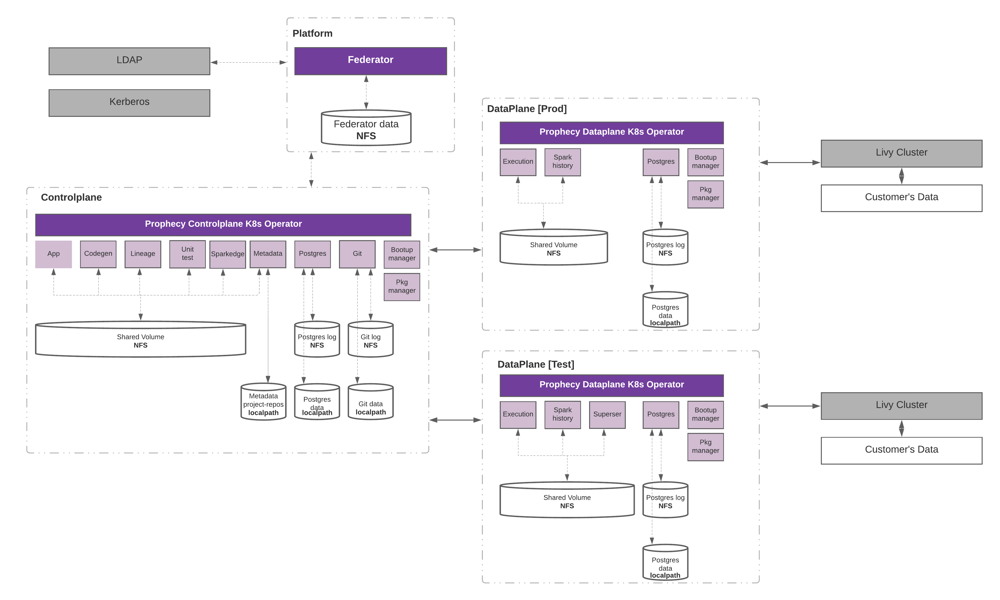

# Introduction

Prophecy application is deployed in three parts:
## [Platform](platform.md)
Set of apps responsible for managing authentication
### List of apps
* Federator

## [Control Plane](controlplane.md) 
Set of apps responsible to serve the core prophecy app. 
### List of apps
* App
* Codegen
* Metagraph
* Gitserver
* Postgres
* Lineage
* Unit test
* Sparkedge
* Bootup manager
* Package manager

## [Data Plane](https://github.com/SimpleDataLabsInc/prophecy/blob/visa_setup/docs/content/en/arch/deploy/visa-github/dataplane.md) 
Set of apps responsible to manage execution fabric.
### List of apps
* Execution
* Postgres
* Sparkhistory
* Bootup manager
* Package manager

## Architecture Diagram

 
 
To deploy prophecy application, admin needs to deploy the platform piece first, followed by controlplane and then dataplane. Please follow the respective sections to deploy these components.

